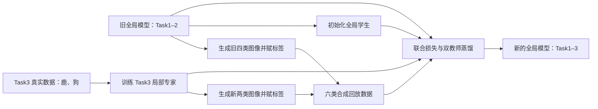
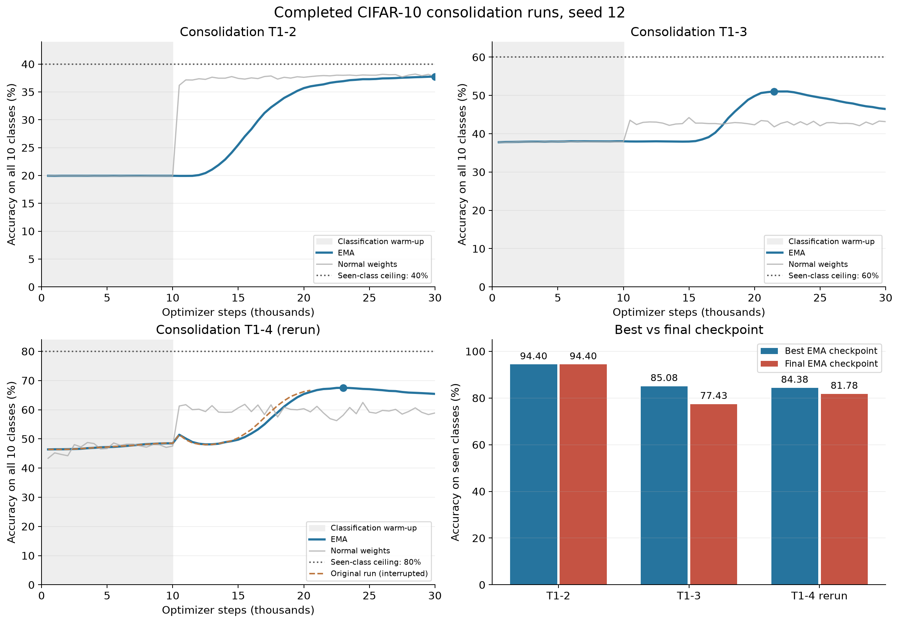
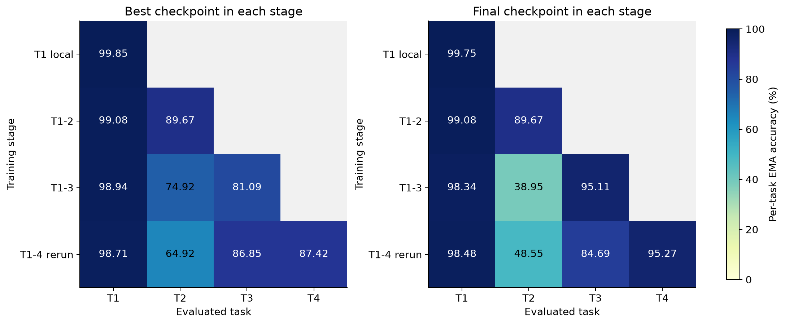
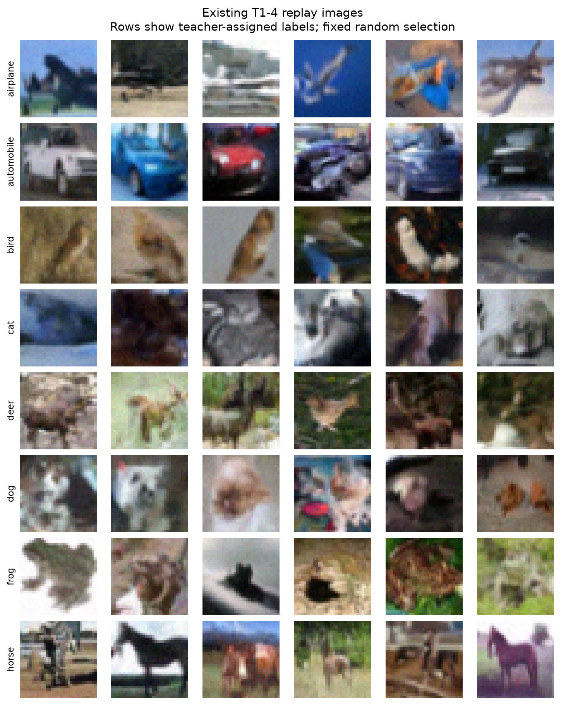

本文根据本地离线 W&B 记录、保存的 checkpoint、运行参数和回放张量整理，时间为 2026-09-29。按用户要求，正在运行的 Task1–5 合并阶段不纳入分析。历史 notebook 中的论文绘图数值也没有作为本次实验结果使用。

先看已经完成的实验。

当前本地实验是 CIFAR-10 全监督类别增量学习。训练集共有 50,000 张 32×32 RGB 图像，测试集有 10,000 张；代码将训练集划成五个任务，每个任务两类、每类 5,000 张。实际加载器检查确认：训练任务使用 `Split.TRAIN`，验证使用 `Split.TEST`，测试集每类 1,000 张。

| 用户称呼 | 代码 task id | 类别 id | 类别 |
|---|---:|---|---|
| Task1 | 0 | 0、1 | 飞机、汽车 |
| Task2 | 1 | 2、3 | 鸟、猫 |
| Task3 | 2 | 4、5 | 鹿、狗 |
| Task4 | 3 | 6、7 | 青蛙、马 |
| Task5 | 4 | 8、9 | 船、卡车 |

单任务模型只学习当前两类，是用于新任务的局部专家。Task1–2、Task1–3 等模型则需要用一个分类器区分所有已学类别，是持续学习的全局模型。单任务专家成绩不能直接当作全局模型的持续学习成绩。

本地共有八个达到设定步数的训练阶段：五个单任务专家，各 50,000 步；三个完整合并阶段，各 30,000 步。另有两条提前结束的历史记录：原 Task1–4 和首次 Task5 专家训练。

| 已完成阶段 | 训练步数 | 全十类测试准确率：最佳 EMA | 全十类测试准确率：结束 EMA | 已学类别准确率：结束 EMA |
|---|---:|---:|---:|---:|
| Task1 单任务 | 50,000 | 19.97% | 19.95% | 99.75% |
| Task2 单任务 | 50,000 | 19.75% | 19.70% | 98.50% |
| Task3 单任务 | 50,000 | 19.85% | 19.81% | 99.05% |
| Task4 单任务 | 50,000 | 19.99% | 19.96% | 99.80% |
| Task5 单任务，`FULL` | 50,000 | 19.93% | 19.86% | 99.30% |
| Task1–2 合并 | 30,000 | 37.76% | 37.76% | 94.40% |
| Task1–3 合并 | 30,000 | 51.05% | 46.46% | 77.43% |
| Task1–4 合并，重跑 | 30,000 | 67.50% | 65.42% | 81.78% |

原 Task1–4 的 `last.ckpt` 保存于 20,500 步，训练日志还有随后少量训练批次，最近一次验证为 20,500 步，EMA 准确率 66.65%。它没有达到设定的 30,000 步，因此不能称为完成整段训练。历史 `TASK5_SEED12_RERUN_T1_5` 的最后 checkpoint 为 42,000 步，也没有达到 50,000 步；上表使用已跑满的 `TASK5_SEED12_FULL`。

读数据时需要区分统计分母。`val/accuracy_ema` 每次都在完整十类测试集上计算，没有按已学类别过滤。单任务只会正确预测自己的两类时，理论最高全测试集准确率就是 20%；两个任务对应 40%，三个任务对应 60%，四个任务对应 80%。所以单任务日志接近 20% 可以代表已学两类的高准确率。

对于本文列出的最佳和结束评估，我逐一核对了对应混淆表：所有未学类别的正确预测数都为零。因此这里可以精确换算：

$$A_{\mathrm{seen}}=A_{\mathrm{all10}}\times\frac{10}{C_{\mathrm{seen}}}.$$

例如 Task1–4 结束时为 $65.42\%\times10/8=81.775\%$，四舍五入为 81.78%。如果未来某次评估能正确预测未学类别，就不能继续直接使用这个换算公式。这里仍然使用十类输出的 argmax；没有通过屏蔽未学类别改变预测结果。

接下来理解模型原理。

JDCL 要解决的问题是：在只接触新任务数据时，如何学习新类别，又保留旧类别的知识。模型将生成器和分类器的编码部分共享，通过生成回放和两个方向的知识蒸馏进行知识整合。这三部分也是原论文的核心设计：[Joint Diffusion Models in Continual Learning](https://arxiv.org/html/2411.08224v2)。

本次实验实际使用 `models/standard_diffusion` 下的像素空间 DDPM。输入、加噪和去噪作用在 3×32×32 图像上，没有调用自编码器先把图像压缩成潜变量。分类用到 U-Net 内部隐藏表示，但这和“在自编码器的压缩潜空间中扩散”是两个不同的概念。仓库也包含潜空间扩散代码，但它不是本次运行的模型。

扩散训练先抽一个随机时间步，再给图像加噪：

$$x_t=\sqrt{\bar\alpha_t}x_0+\sqrt{1-\bar\alpha_t}\epsilon,\qquad\epsilon\sim\mathcal N(0,I).$$

这里 $x_0$ 是图像，$t$ 表示噪声强度，$\bar\alpha_t$ 表示保留多少图像信号。模型预测加入的噪声，训练目标为：

$$L_{\mathrm{diff}}=\mathbb E\left[\|\epsilon-\epsilon_\theta(x_t,t)\|^2\right].$$

训练时每张图随机抽一个时间步；配置中的 1,000 个扩散时间步不意味着每个训练 batch 要执行 1,000 次网络前向。生成图像时才需要从噪声开始反复去噪；本次回放使用 250 步 DDIM 采样。

分类分支将干净图像的增强视图送入同一个 U-Net 编码器，时间输入为 0，把不同深度的特征图做全局平均池化并拼接为 3,712 维向量，再通过 `3712 → 1024 → 10` 的分类头输出 logits。分类损失是交叉熵。扩散分支处理含噪视图，分类分支处理干净的强增强视图；它们共享参数，但输入视图不同。

可以从联合概率理解这种设计：$p(x,y)=p(x)p(y\mid x)$。生成部分学习图像分布，分类部分学习给定图像后的类别分布。共享编码器同时受到两种监督，生成知识和分类知识因此存在共同的表示基础。

局部阶段的主要损失为：

$$L_{\mathrm{local}}=L_{\mathrm{diff}}+0.001L_{\mathrm{CE}}.$$

新任务到来后，全局阶段使用两个权重固定的教师：旧全局模型教旧类别，新局部模型教新类别。扩散蒸馏让学生在相同含噪输入上模仿教师的噪声预测；分类蒸馏让学生模仿教师的完整类别概率分布。

$$L_{\mathrm{KD,diff}}=\|\epsilon_{\mathrm{student}}-\epsilon_{\mathrm{teacher}}\|^2,\qquad L_{\mathrm{KD,cls}}=-\sum_c p_{\mathrm{teacher}}(c\mid x)\log p_{\mathrm{student}}(c\mid x).$$

例如硬标签只说“这是猫”，软概率还可以表达“它也有一点像狗”。代码文件名使用 `kl`，具体实现是教师 softmax 概率和学生 logits 的软目标交叉熵；对固定教师而言，它与 KL 散度相差一个不依赖学生参数的教师熵项。

全局阶段的主要损失，可按配置写成：

$$L_{\mathrm{global}}\approx0.01L_{\mathrm{diff}}+1.0L_{\mathrm{KD,diff}}+0.00001L_{\mathrm{CE}}+0.001L_{\mathrm{KD,cls}}.$$

其中两个蒸馏项还会按旧样本和新样本在 batch 中的数量加权：代码权重分别为 $2n_{old}/(n_{old}+n_{new})$ 和 $2n_{new}/(n_{old}+n_{new})$，不是把两组无条件按 1:1 混合。分类项按 `classification_start: 10000` 延后开启；前约 10,000 步主要进行去噪学习和扩散蒸馏。因此新类别前期准确率接近零，与当前训练计划相符。

EMA 表示参数的指数移动平均：$\bar\theta\leftarrow\rho\bar\theta+(1-\rho)\theta$。代码分别评估普通权重和 EMA 权重，并用 `val/accuracy_ema` 选择最佳 checkpoint。以下分析统一采用 EMA 准确率。

现在沿着 Task3 的到来，学习实验设计。

先有一个能区分飞机、汽车、鸟、猫的旧全局模型。Task3 的真实数据只有鹿和狗。当前脚本先从头训练鹿/狗局部专家，再用旧模型生成旧四类样本、用局部专家生成鹿/狗样本，各类凑齐 1,000 张。两个教师给各自生成的图像预测标签。接着把旧全局模型复制为学生，让学生在这六类合成数据上训练 30,000 步，同时模仿两个教师。



本地脚本的局部专家调用没有 `-c`，所以是从头训练；原论文描述的局部阶段则是复制当前模型后适应新任务。学习和复现实验时，应把论文概念与当前代码的具体运行方式分别记录。

`train_joint_diffusion_cl.py` 的参数可以这样读：`-t` 选择新任务，`-o` 指定旧教师，`-n` 指定新教师，`-c` 指定学生的初始化 checkpoint，`-l` 列出已经学过的任务。`-c` 在这里加载模型权重，`trainer.fit` 没有传入用于完整恢复训练状态的 `ckpt_path`；因此它不能直接理解成恢复优化器状态和继续原 step 编号。

| 设计选择 | 当前设置 | 理解它的作用 |
|---|---|---|
| 标签使用 | 全监督 | 每个局部任务的真实训练图像均有标签 |
| 任务划分 | 固定连续两类一组 | 明确每个阶段新增哪些类别 |
| 分类输出 | 始终十类，评估不用 task id | 要学习跨任务分类边界 |
| 局部训练 | 每阶段 50,000 optimizer steps | 建立当前新任务专家 |
| 全局训练 | 每阶段 30,000 optimizer steps | 整合旧知识和新知识 |
| 前期分类延后 | 约 10,000 步 | 先让生成部分适应合成分布 |
| 回放数据 | 已学每类 1,000 张 | 保持类别数量平衡 |
| 全局真实图像使用 | `unconditional_replay_only` | 全局阶段使用旧、新教师的合成图像 |
| 训练 batch | 256，梯度累积 1 | 有效 batch 为 256 |
| 生成 batch | 1,000 | 控制采样吞吐和显存占用，与训练 batch 不同 |
| 学习率和优化器 | 0.0002，AdamW | 共同更新共享编码器、解码器、分类头 |
| 分类增强 | 翻转、裁剪、RandAugment | 降低对单一输入外观的依赖 |
| seed | 12 | 目前只有一个 seed 的实验链 |

一个 epoch 由 `RandomSampler` 设置为至少 500 个 batch：当前 batch 为 256，因此一个 epoch 采样 128,000 次。单任务 50,000 步对应 100 个这种 epoch，共 1,280 万次样本输入；它不等于把 10,000 张当前任务图像只遍历 100 遍。合并 30,000 步共有 768 万次样本输入，因此较小的合成数据集会被反复使用，数据增强和回放多样性都很重要。

带着实验问题学习设计时，建议先明确三个假设：共享表示能帮助知识保留，局部/全局两阶段能兼顾新任务学习和旧任务保持，蒸馏能降低合成回放造成的知识漂移。然后为每个假设设计对照：独立生成器与分类器、单阶段训练、关闭蒸馏。所有对照应尽量固定任务划分、训练预算、回放数据和模型容量。当前已有记录都使用完整方法，没有这些消融对照，因此能描述完整方法的行为，不能单凭这些记录证明每个组件贡献多少。

应同时报告已学类别整体准确率和任务准确率矩阵。前者回答“当前总体表现怎样”，后者回答“哪个旧任务被遗忘”。正式评估应把验证集与最终测试集分开：当前代码将 test 集直接用于验证和最佳 checkpoint 选择，所以这里的 best 是测试集选择后的诊断结果，不应把它直接视为无偏的最终评估。

最后分析现有数据。



Task1–2 的已学类别结束准确率为 94.40%，最后一步也是最佳点。它对飞机/汽车保持较好，对鸟/猫在合并后有一定损失。单任务局部专家高准确率，说明本次训练已经建立了能够识别各自类别的专家；后续较大损失集中在全局整合阶段。

| 完整合并阶段 | 最佳点所在训练步数 | 已学类别最佳 EMA | 已学类别结束 EMA | 结束比最佳低 |
|---|---:|---:|---:|---:|
| Task1–2 | 30,000 | 94.40% | 94.40% | 0.00 个百分点 |
| Task1–3 | 21,500 | 85.08% | 77.43% | 7.65 个百分点 |
| Task1–4 重跑 | 23,000 | 84.38% | 81.78% | 2.60 个百分点 |


Task1–3 在最佳点到训练结束之间，全十类 EMA 准确率从 51.05% 降至 46.46%。这不是全部任务一起变差：鸟/猫从约 74.92% 降至 38.95%，鹿/狗却从约 81.09% 升至 95.11%。继续训练仍在学习新任务，同时显著损害了某个旧任务。

Task1–4 重跑也有同样方向的变化：最佳整体点到结束，鸟/猫从约 64.92% 降至 48.55%；青蛙/马从约 87.42% 升至 95.27%。所以“损失下降”“新任务越来越准”和“持续学习表现更好”不能互相替代。

| 全局模型的结束评估 | Task1 飞机/汽车 | Task2 鸟/猫 | Task3 鹿/狗 | Task4 青蛙/马 |
|---|---:|---:|---:|---:|
| Task1–2 | 99.08% | 89.67% | — | — |
| Task1–3 | 98.34% | 38.95% | 95.11% | — |
| Task1–4 重跑 | 98.48% | 48.55% | 84.69% | 95.27% |

任务表使用代码已记录的 `cl_tasks_val/taskN_accuracy_ema`。这些指标先计算 batch 内当前任务的准确率，再由 Lightning 聚合，分母不完全等同于直接汇总整项任务的正确样本数，因此与整体准确率的严格换算存在很小差异。此表适合判断幅度较大的趋势。



Task1 到第四个阶段仍约 98.48%，保持稳定；Task2 从第一次全局学习后的约 89.67% 降到约 48.55%，是当前主要遗忘对象。Task3 从约 95.11% 降至约 84.69%，也受到下一任务训练的影响。第四阶段的整体平均比第三阶段结束更高，部分原因是新增青蛙/马的准确率较高；这不表示所有旧任务都恢复了。

用阶段结束点可以学习遗忘率的计算：设 $a_{k,j}$ 为学完第 $k$ 个任务后、对第 $j$ 个任务的准确率，则

$$F_k=\frac1{k-1}\sum_{j<k}\left(\max_{j\le m<k}a_{m,j}-a_{k,j}\right).$$

在本次阶段结束矩阵上，第四阶段旧任务平均遗忘约为 $(1.27+41.12+10.42)/3=17.60$ 个百分点。它是基于现有日志的近似描述，使用全局阶段结束点；没有把独立训练的 Task2/Task3 局部专家准确率混入全局遗忘率，也不是尚未完成的五任务最终遗忘率。

已有合并脚本把 `last.ckpt` 用于后续的旧教师和学生初始化。Task1–3 后续阶段实际承接的是 46.46% 的结束模型，而不是 51.05% 的最佳模型。检查点选择因而会影响之后的整条实验链。这里揭示一个需要对照验证的选择：按最后一步传递，还是按单独验证集选择的最佳步骤传递。分类最佳检查点未必也是生成质量最佳的检查点，不能直接保证改用 best 后整条链一定改善。

原 Task1–4 与重跑的图像张量和标签张量 SHA-256 完全相同，均为每类 1,000 张、共 8,000 张。重跑没有换一批合成图像。但是原运行只到约 20,500 步验证，重跑到 30,000 步；在相同 20,500 步，原运行 66.65%，重跑 66.08%。两者同 seed 也未必有相同随机轨迹，因为重跑跳过了生成数据过程，而生成过程会消耗随机状态。所以不能用重跑最佳 67.50% 高于原最佳 66.65%，来声称某个算法改动带来确定提升。

回放张量检查结果如下。

| 回放数据 | 总数 | 每类数量 | 完全相同图像去重后数量 | 数值范围 |
|---|---:|---:|---:|---|
| Task1–2 | 4,000 | 1,000 | 4,000 | [0, 1] |
| Task1–3 | 6,000 | 1,000 | 6,000 | [0, 1] |
| Task1–4 原运行/重跑 | 各 8,000 | 1,000 | 各 8,000 | [0, 1] |

因此没有数量层面的类别失衡，也没有字节完全相同的图像重复。它们仍可能存在近似重复、样本覆盖不足和教师伪标签错误；这些需要额外指标或人工标注来验证。当前配置关闭了 FID callback，本次记录没有用于量化生成分布质量的 FID 结果。



这张网格直接来自已有 Task1–4 回放张量，每类按固定随机数选六张，没有重新生成或筛选最好看的样本。每行的名称是教师分配的标签，不是人工审核的真实标签。

现有数据支持的判断是：完整训练流程已经完成到第四任务的全局模型；局部专家表现较高；新旧任务整合出现显著而有选择性的遗忘，尤其集中在鸟/猫；阶段后期继续训练会出现新任务提升、整体性能回落。当前只有 seed 12，没有组件消融，也没有 Task1–5 结束数据，尚不能计算五任务最终成绩、跨 seed 方差，或声称复现了论文全部结果。

代码核对还发现几项直接影响实验解释的细节。

- `train_joint_diffusion_cl.py:367` 将 `weight_reinit` 与列表作相等比较，但配置值是字符串 `"unused classes"`；这个值不会匹配该分支，预期的未用类别输出权重重初始化没有执行。
- `train_joint_diffusion_cl.py:272–305` 在 EMA scope 内生成图像，退出后用普通权重的分类器赋标签；所以“EMA 生成”不等于“EMA 分类器赋标签”。生成函数也没有显式将教师设为 eval，可能受 dropout 影响。
- `JointDiffusionNoisyClassifier.on_validation_epoch_end` 的混淆表汇总了普通权重和 EMA 两次预测，所以完整验证表有 20,000 个预测计数。不能把它直接当作单独 EMA 的混淆矩阵。本文准确率主表使用独立 EMA 标量指标。
- `callbacks.py` 的 `SetupCallback` 将 dataloading 配置写入了名为 `lightning.yaml` 的文件；该文件不能用于核实历史 trainer 配置。因此本文完成状态用 checkpoint step 和 W&B 的 `max_steps reached` 消息交叉验证。

这些细节可以列为后续对照实验的变量；本次整理仅新增分析文件，没有修改训练脚本、原始记录或 checkpoint，也没有使用 GPU 干扰当前 Task1–5 运行。

继续学习时，可以按以下步骤操作。

1. 阅读单任务配置，指出扩散分支和分类分支各自使用哪种输入、哪种损失。
2. 阅读 Task1–2 的合并配置和脚本，写出旧教师、新教师和学生分别从哪个 checkpoint 来。
3. 在 `per_task_curves.png` 找到 10,000 步和最佳整体点，解释为何新任务尚未改善、或已改善但总体在下降。
4. 使用 `per_task_accuracy.csv` 手算第四阶段 Task2 的性能下降，再计算旧任务平均遗忘率。
5. 在完整五任务结束后固定评估规则，再设计只改变一项因素的检查点选择或蒸馏消融对照。

数据与代码入口：

- [运行汇总 CSV](run_summary.csv)、[任务指标 CSV](per_task_accuracy.csv)、[完整提取 JSON](results.json)、[回放审计 JSON](replay_audit.json)。
- [逐次验证与每 epoch 训练指标](history/)。
- [离线提取脚本](extract_results.py)、[绘图脚本](plot_results.py)。
- [单任务配置](../../configs/standard_diffusion/continual_learning/joint_diffusion_pooling/cifar10/cifar10_sigle_task.yaml)、[首个合并配置](../../configs/standard_diffusion/continual_learning/joint_diffusion_pooling/cifar10/cifar10_kl_t2.yaml)。
- [实验串联脚本](../../cifar10.sh)、[训练入口](../../train_joint_diffusion_cl.py)、[联合模型与蒸馏](../../models/standard_diffusion/joint_diffusion.py)、[生成回放](../../cl_methods/generative_replay.py)。

提取脚本使用现有 `jdcl` Python 环境运行，原文件以只读方式打开，checkpoint 仅映射到 CPU。图表由 Matplotlib 绘制，同时保存 PNG 和 SVG。运行示例：

```bash
/home/gonc/miniconda3/envs/jdcl/bin/python analysis/completed_experiments_20260929/extract_results.py
PYTHONPATH=/tmp/jdcl_analysis_plot_deps /home/gonc/miniconda3/envs/jdcl/bin/python analysis/completed_experiments_20260929/plot_results.py
```

绘图依赖安装在临时目录 `/tmp/jdcl_analysis_plot_deps`，没有改动正在使用的训练环境。若临时目录被清理，可将 Matplotlib 安装到其他独立目录后相应替换 `PYTHONPATH`。
