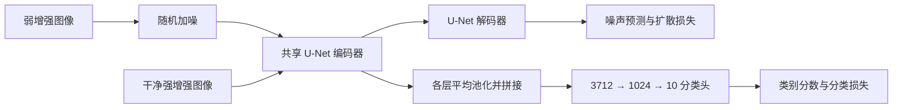
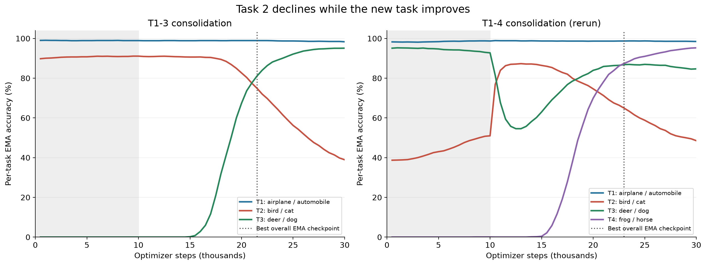

这份指南围绕本仓库实际运行的 CIFAR-10 全监督实验展开。目标是让你能解释算法、找到对应代码、自己启动实验、读懂结果，并设计一项可验证的改进。阅读时默认你能看懂基本 Python；涉及的机器学习概念会从例子开始说明。

教学内容根据 2026-09-29 核对的代码和运行环境编写。完整五任务的训练状态及最终数值，以文末“结果篇”为准。此前 Task1–4 的分析保留在[已完成阶段的分析报告](../analysis/completed_experiments_20260929/实验讲解与分析.md)，它是阶段快照。

建议分几次学习，每次完成一项具体产出。下面的链接可以直接跳到对应内容。

| 阅读顺序 | 这一遍要掌握什么 | 完成后自己的产出 |
|---|---|---|
| [第一课](#lesson-1) | 数据、任务、局部和全局模型 | 画出五个任务的顺序 |
| [第二课](#lesson-2) | 张量、损失、梯度和参数更新 | 写出一个 batch 的形状 |
| [第三课](#lesson-3) | 加噪、去噪和生成 | 手算一次加噪与噪声误差 |
| [第四课](#lesson-4) | 共享编码器与联合建模 | 画出生成、分类两条分支 |
| [第五课](#lesson-5) | 两阶段训练和双教师蒸馏 | 写出 Task3 到来时的算法 |
| [第六课](#lesson-6) | 代码调用链和配置 | 给关键函数写中文注释 |
| [第七课](#lesson-7) | 环境、短试和独立复现 | 用独立目录完成一次短试 |
| [第八课](#lesson-8) | 准确率、遗忘率和检查点 | 用 CSV 复算一项结果 |
| [第九课](#lesson-9) | 对照实验与问题定位 | 写一份只改变一个因素的实验计划 |
| [第十课](#lesson-10) | 排错与理解检验 | 对照自己的答案修正理解 |
| [结果篇](#final-results) | 所有任务结束后的数据 | 对最终结果作证据支持的判断 |

<a id="lesson-1"></a>

第一课的目标，是准确说出这个实验要解决什么问题。

CIFAR-10 每张图像为 32×32 像素、三个颜色通道。标准训练集有 50,000 张，测试集有 10,000 张，每类分别有 5,000 和 1,000 张。本地数据加载器已核对：训练任务取训练集，验证取测试集。

| 用户称呼 | 命令中的 `-t` | 类别编号 | 类别 |
|---|---:|---|---|
| Task1 | 0 | 0、1 | 飞机、汽车 |
| Task2 | 1 | 2、3 | 鸟、猫 |
| Task3 | 2 | 4、5 | 鹿、狗 |
| Task4 | 3 | 6、7 | 青蛙、马 |
| Task5 | 4 | 8、9 | 船、卡车 |

`-t` 从零开始，中文任务名从一开始，这是容易发生的编号错误。

普通联合训练会同时看到全部十类真实图像。当前持续学习设置则依次提供新任务，学习后面的任务时，旧任务通过模型生成的图像回放。评估时只有一个十类分类器，不提供“这张图属于哪个任务”的提示。

用 $L_k$ 表示只学习第 $k$ 个任务的局部专家，用 $G_k$ 表示整合了前 $k$ 个任务的全局模型。则 $L_3$ 擅长鹿和狗；$G_3$ 需要区分飞机、汽车、鸟、猫、鹿、狗。它们的评价对象不同。

当前运行链可以写成：

```text
L1 = G1
L2 + G1 → G2
L3 + G2 → G3
L4 + G3 → G4
L5 + G4 → G5
```

局部模型从真实当前任务学习，再帮助全局模型整合新知识。完整一次五任务运行包含五个局部训练和四个全局合并，共九个训练阶段。

灾难性遗忘指模型适应新数据后，旧任务表现明显退化。比如一个模型先把鸟、猫分得很好，加入鹿、狗后却把大量猫认成狗。判断持续学习是否成功，必须检查旧任务，而不能只看新任务准确率。

<a id="lesson-2"></a>

第二课的目标，是把图片和标签对应到模型实际处理的数字。

图像由像素值组成，`ToTensor` 把图像转为浮点张量。当前归一化设置是均值和标准差都为 0.5，因此输入的单个像素由 $p\in[0,1]$ 转为 $(p-0.5)/0.5=2p-1$，大致落在 $[-1,1]$。生成回放时又会反归一化、裁剪至 $[0,1]$，以便后续图像增强使用。

一个 batch 表示一次共同处理的一组样本。当前训练 batch 为 256：

| 数据 | 张量形状 | 意义 |
|---|---|---|
| 扩散图像视图 | `[256, 3, 32, 32]` | 弱增强图像 |
| 分类图像视图 | `[256, 3, 32, 32]` | 强增强图像 |
| 类别标签 | `[256]` | 每张图对应一个类别编号 |
| 随机时间步 | `[256]` | 每张图的噪声强度编号 |
| 噪声预测 | `[256, 3, 32, 32]` | 预测每个位置加入的噪声 |
| 分类特征 | `[256, 3712]` | 各层特征池化后拼接 |
| 分类 logits | `[256, 10]` | 十个类别的分数 |
| 总损失 | 标量 | 用于一次反向传播的误差 |

logits 是未归一化分数。softmax 把它们转成总和为 1 的概率；argmax 取分数最大的类别。计算交叉熵时，PyTorch 的 `cross_entropy` 可以直接接收 logits，不需要自己先做 softmax。

损失衡量当前预测与目标的差异，梯度说明参数变化如何影响损失。一个训练步骤的顺序是：前向计算预测、计算损失、反向计算梯度、优化器更新参数。当前使用 AdamW，共同更新共享编码器、扩散解码器和分类头。

梯度累积会先处理多个物理 batch，再更新一次参数。若物理 batch 为 $B$、累积次数为 $A$、使用 $D$ 个数据并行设备，则通常的有效 batch 为 $BAD$。本次 $B=256,A=1,D=1$，有效 batch 为 256。训练 batch 128 配合累积 2，也会得到有效 batch 256；样本顺序、增强和训练细节仍可能不同。

`--replay-sample-batch-size` 控制一次生成多少图像，属于回放构建阶段；`--batch-size` 控制训练和验证的 batch。生成 batch 为 1,000，不表示每次训练用 1,000 张图。

<a id="lesson-3"></a>

第三课的目标，是理解模型为何学预测噪声，却能够生成图片。

训练数据给我们真实图像 $x_0$，人为添加的随机噪声 $\epsilon$ 也完全已知。扩散过程构造不同噪声强度的输入：

$$x_t=\sqrt{\bar\alpha_t}x_0+\sqrt{1-\bar\alpha_t}\epsilon,\qquad\epsilon\sim\mathcal N(0,I).$$

$\bar\alpha_t$ 表示图像信号保留的比例，$t$ 是扩散时间步。本地配置使用 1,000 个时间步，但训练中每张样本随机抽取一个 $t$，从而学习多种噪声强度。

用一个像素手算：取 $x_0=0.4$，$\bar\alpha_t=0.64$，$\epsilon=0.5$，则 $x_t=0.8\times0.4+0.6\times0.5=0.62$。如果模型预测噪声为 0.3，这个位置的平方误差就是 $(0.5-0.3)^2=0.04$。

模型训练目标为：

$$L_{\mathrm{diff}}=\mathbb E_{x_0,t,\epsilon}\left[\|\epsilon-\epsilon_\theta(x_t,t)\|^2\right].$$

模型输入图像和时间步，输出对应的噪声预测。反复见到不同真实图像及其加噪版本后，网络学习如何区分图像结构和噪声。生成时，从随机噪声开始，反复使用这种预测向图像分布移动。噪声预测训练和反向生成是同一扩散模型的两个阶段。[DDPM 论文](https://arxiv.org/abs/2006.11239)

本地用 250 步 DDIM 生成回放数据。DDIM 提供与去噪训练配套的另一种采样过程，可减少采样所用的步骤；本实验的 250 来自 `cl.ddim_steps` 配置。[DDIM 论文](https://arxiv.org/abs/2010.02502)

目前的图像采样是无条件生成，然后由模型分类并筛选，直到满足每类配额；`grad_scale: 0` 没有提供额外分类梯度引导。理解配置时，要同时看 `cl.sampling_method` 和实际采样函数。

本次扩散作用于图像像素。U-Net 内部存在隐藏特征，这些特征用于分类；它们和自编码器压缩图像得到的潜变量不同。仓库里的 `models/latent_diffusion` 属于其他实现，本次 CIFAR-10 链运行的是 `models/standard_diffusion`。

<a id="lesson-4"></a>

第四课的目标，是弄清联合模型中的哪些参数共享，哪些输出不同。

当前模型将 U-Net 编码器用于两条计算路径。含噪图像送入编码器和解码器，输出噪声预测；干净的强增强图像以时间步 0 送入共享编码器，各层隐藏特征做全局平均池化并拼接，随后交给分类头。



这张图表示共享权重关系。扩散和分类在代码中分别前向计算，并不是把强增强干净输入和含噪输入当作同一张张量处理。

分类头的 3,712 维输入来自多个尺度特征的通道数拼接。设置 `pool_size: 10000` 时，当前特征图都小于该值，所以代码对每张特征图做全局平均池化。你可以在 `AdjustedUNet.pool_representations` 找到这个逻辑。

联合建模的概率关系是 $p(x,y)=p(x)p(y\mid x)$：生成部分描述图像分布，分类部分描述给定图像后的类别分布。局部阶段主要优化：

$$L_{\mathrm{local}}=L_{\mathrm{diff}}+0.001L_{\mathrm{CE}}.$$

分类损失和生成损失共同改变编码器，因此两个任务的表示存在关联。0.001 是损失权重，不代表分类任务只占训练效果的 0.1%；实际影响还取决于各项梯度的大小和方向。

这种共享表示、生成回放和知识蒸馏的结合，是 JDCL 的方法框架。[JDCL 论文](https://arxiv.org/html/2411.08224v2)

<a id="lesson-5"></a>

第五课的目标，是能不用论文符号，完整描述一次新任务整合。

以加入 Task3 为例，旧全局模型 $G_2$ 已经学习飞机、汽车、鸟、猫，新真实数据只有鹿、狗。

先在真实鹿、狗图像上训练局部模型 $L_3$，得到新任务专家。本地脚本没有给这次单任务训练传入 `-c`，所以它从头开始训练；论文方法描述中的局部模型复制策略与当前脚本调用，需要分别记录。

随后，$G_2$ 无条件生成旧四类图像并预测标签，$L_3$ 无条件生成鹿、狗并预测标签。每类接收 1,000 张，得到六类、6,000 张合成图像。筛选依据是教师预测，合成标签并不等于人工审核的真实标签。

学生从旧全局模型初始化，接受旧、新两个教师。旧类别输入由旧教师提供蒸馏目标，新类别输入由新教师提供目标。教师权重通过无梯度计算参与训练，学生权重接受更新。

扩散蒸馏使用相同的含噪输入和时间步，比较学生与教师的噪声预测：

$$L_{\mathrm{KD,diff}}=\|\epsilon_s(x_t,t)-\epsilon_f(x_t,t)\|^2.$$

分类蒸馏比较类别概率分布：

$$L_{\mathrm{KD,cls}}=-\sum_c p_f(c\mid x)\log p_s(c\mid x).$$

用两类例子理解软目标：教师给出的概率为 `[0.8, 0.2]`，学生给出的概率为 `[0.6, 0.4]`。软目标交叉熵约为 0.5919；教师自身的熵约为 0.5004；两者相减，KL 散度约为 0.0915。若学生完全匹配教师，KL 为零，但软目标交叉熵仍等于教师熵。对固定教师，两种损失对学生参数的梯度相同。

`cifar10_kl_t*.yaml` 和实现使用这种软目标交叉熵，没有额外设置更高的蒸馏温度。不要仅凭文件名就假设它逐项调用 `kl_div`。

全局训练的主要目标按当前配置写成：

$$L=0.01L_{\mathrm{diff}}+L_{\mathrm{KD,diff}}+0.00001L_{\mathrm{CE}}+0.001L_{\mathrm{KD,cls}}.$$

两个蒸馏项分别包含旧组与新组的加权平均，旧组权重为 $2n_o/(n_o+n_n)$，新组为 $2n_n/(n_o+n_n)$。例如 Task1–4 数据中旧六类、新两类，各类数量相同，所以长期期望旧组占 75%、新组占 25%，对应组权重为 1.5 和 0.5。这个权重会乘到各组内部平均损失上。

分类项按 `classification_start: 10000` 延后约 10,000 个优化步骤开启。此前编码器仍通过生成目标更新，所以分类表现也可能变化。开启分类损失之后，EMA、新类别输出初始状态等因素又会影响准确率改善的时间，不要求它恰好在第 10,001 步立刻明显上升。

把这一过程写成接近实际计算的伪代码：

```python
# 构建数据：在训练学生之前完成
replay_old = sample_and_predict_labels(old_teacher)
replay_new = sample_and_predict_labels(new_teacher)
replay = balance_each_class(replay_old + replay_new, count=1000)
student = load_weights(previous_global_checkpoint)

for optimizer_step in range(30000):
    x_weak, x_strong, labels = next_augmented_batch(replay)
    t = random_diffusion_timesteps(batch_size)
    noise = random_normal_like(x_weak)
    x_noisy = add_noise(x_weak, t, noise)

    predicted_noise = student.denoiser(x_noisy, t)
    logits = student.classifier(student.encoder(x_strong, time=0))
    loss = 0.01 * mse(predicted_noise, noise)

    # 按标签属于旧类还是新类选择教师，再按组内样本数加权
    loss += diffusion_distillation(student, old_teacher, new_teacher)
    if classification_warmup_finished:
        loss += 0.00001 * cross_entropy(logits, labels)
        loss += 0.001 * classifier_distillation(student, old_teacher, new_teacher)

    loss.backward()
    optimizer.step()
    optimizer.zero_grad()
```

这是解释计算关系的伪代码，函数名不直接对应可运行接口。真实执行由 Lightning 管理，EMA 的更新钩子和分类延后计数应以实现为准。

<a id="lesson-6"></a>

第六课的目标，是从一个命令追踪到真正计算损失的函数。

从下面的路径读代码，先抓函数责任，再读内部细节。

| 阅读入口 | 核心责任 | 阅读时要能指出什么 |
|---|---|---|
| [cifar10.sh](../cifar10.sh) | 串联九个阶段 | 每个全局阶段依赖哪些 checkpoint |
| [train_joint_diffusion_cl.py](../train_joint_diffusion_cl.py) | 解析参数、构建模型和训练器 | `-t/-o/-n/-c/-l` 的关系 |
| [dataloading](../dataloading/__init__.py) | 建立训练、验证数据 | 训练和测试集怎样分开 |
| [cl_split.py](../dataloading/splitting/cl_split.py) | 按类别划分任务 | 第三任务为什么只取类别 4、5 |
| [generative_replay.py](../cl_methods/generative_replay.py) | 构建回放数据 | 每类配额如何满足、文件何时保存 |
| [joint_diffusion.py](../models/standard_diffusion/joint_diffusion.py) | 分类、扩散和蒸馏 | 哪些输入、损失、教师按掩码区分 |
| [adjusted_unet.py](../models/adjusted_unet.py) | 提供噪声输出和多层特征 | 池化怎样得到分类特征 |
| [DDPM 基类](../latent-diffusion/ldm/models/diffusion/ddpm.py) | 扩散基础与训练钩子 | 验证如何分别使用普通和 EMA 权重 |

当前单任务模型类型是 `joint_diffusion_augmentations`，合并模型类型是 `joint_diffusion_knowledge_distillation`。模型类型通过 `models.get_model_class` 映射到具体类。

重点阅读 `JointDiffusionAugmentations.get_input`：训练数据有两个增强视图，第一个用于扩散，第二个保存在 `x_start` 中用于分类。然后阅读 `JointDiffusion.apply_model`：含噪输入走重建路径，分类使用 `x_start` 和零时间步走表示路径。最后阅读 `JointDiffusionKnowledgeDistillation.p_losses`：构建旧、新标签掩码，分别计算教师输出和蒸馏项。

配置分为四类：

| 配置区域 | 示例参数 | 控制什么 |
|---|---|---|
| `model` | 学习率、分类损失权重、U-Net | 网络和训练目标 |
| `cl` | 回放类型、DDIM 步数、每类图像数 | 持续学习和采样策略 |
| `dataloaders` | 类别任务、batch、增强 | 数据如何进入模型 |
| `lightning` | `max_steps`、callbacks | 执行预算、日志、保存 |

一个配置项的名字不能代替代码走读。例子是 `augmentations: False`：它关闭模型内部的某套 Kornia 增强，但数据加载器仍然有 `ParallelTransforms`、裁剪和 RandAugment，所以训练图像仍经过增强。

还需要记录当前代码的几处实现细节：

- `weight_reinit` 配置为字符串 `"unused classes"`，代码却与列表作相等比较，当前没有匹配到对应重初始化分支。
- 生成函数在 EMA scope 中采样，退出后用普通分类器权重赋标签；采样函数也没有显式将教师设为 eval。权重版本和 dropout 会影响回放解释。
- 完整验证混淆表混合普通和 EMA 两遍预测，共 20,000 个计数。单独 EMA 分析要读取 `val/accuracy_ema` 和对应任务指标。
- 保存的 `lightning.yaml` 实际写入 dataloading 配置。核实完成步数要结合 checkpoint 与日志，不能只凭这个文件名。

这些是已经核对的实现事实。本教程的命令保持现有训练协议；改进这些行为时，应另开实验目录，记录修改，并通过对照评价影响。

<a id="lesson-7"></a>

第七课的目标，是能够在现有环境中操作一次独立实验。

以下命令需要从仓库根目录执行。先完成当前训练，再启动占用同一 GPU 的学习演练。文档中的命令是供你运行的教程，本次整理没有启动额外训练。

先激活已有环境并设置本地依赖路径：

```bash
cd /home/gonc/ai/JDCL/Joint-Diffusion-in-Latent-Space
conda activate jdcl
export PYTHONPATH="$PWD/latent-diffusion:$PWD/src/taming-transformers:$PWD/src/clip${PYTHONPATH:+:$PYTHONPATH}"
export WANDB_MODE=offline
```

本地核对的版本为 Python 3.12.14、PyTorch 2.7.1+cu128、torchvision 0.22.1+cu128、Lightning 2.4.0、W&B 0.18.1、OmegaConf 2.3.0 和 Kornia 0.7.3。换机器时，使用仓库的 `environment.yml` 建立环境，再检查依赖导入及 CUDA；本地源代码路径也要对应新机器。

下面的命令只检查环境：

```bash
python - <<'PY'
import sys
import torch
import pytorch_lightning
import taming, ldm, clip

print('Python:', sys.executable)
print('PyTorch:', torch.__version__)
print('CUDA build:', torch.version.cuda)
print('CUDA available:', torch.cuda.is_available())
if torch.cuda.is_available():
    print('GPU:', torch.cuda.get_device_name(0))
PY
```

然后做 20 步的短试，验证数据、模型、验证和 checkpoint 保存能连起来。短试配置已经放在 [cifar10_task1_smoke.yaml](../configs/local_study/cifar10_task1_smoke.yaml)，关闭图像生成回调，每次只验证两个 batch。

```bash
python train_joint_diffusion_cl.py \
  -p configs/local_study/cifar10_task1_smoke.yaml \
  -t 0 \
  -d STUDY_CIFAR10_TASK1_SMOKE_SEED42 \
  --seed 42 \
  --batch-size 16 \
  --accumulate-grad-batches 1 \
  --replay-sample-batch-size 16
```

完成标志是日志出现 `max_steps=20 reached`，并能在 `logs/STUDY_CIFAR10_TASK1_SMOKE_SEED42/checkpoints/` 找到保存的文件。这个 20 步模型只是流程检查产物；正式模型训练预算是 50,000 步，而且完整评估应覆盖全部测试样本。

理解短试之后，可以单独运行一个完整 Task1，并使用新的目录名：

```bash
python train_joint_diffusion_cl.py \
  -p configs/standard_diffusion/continual_learning/joint_diffusion_pooling/cifar10/cifar10_sigle_task.yaml \
  -t 0 -d STUDY_CIFAR10_TASK1_SEED42 \
  --seed 42 --batch-size 256 --accumulate-grad-batches 1 \
  --replay-sample-batch-size 1000
```

单独训练 Task2 时改为 `-t 1`，目录改为 `STUDY_CIFAR10_TASK2_SEED42`。当这两个完整专家都准备好后，首次合并的命令为：

```bash
python train_joint_diffusion_cl.py \
  -p configs/standard_diffusion/continual_learning/joint_diffusion_pooling/cifar10/cifar10_kl_t2.yaml \
  -t 1 -l 0 \
  -o logs/STUDY_CIFAR10_TASK1_SEED42/checkpoints/last.ckpt \
  -n logs/STUDY_CIFAR10_TASK2_SEED42/checkpoints/last.ckpt \
  -c logs/STUDY_CIFAR10_TASK1_SEED42/checkpoints/last.ckpt \
  -d STUDY_CIFAR10_TASK1-2_SEED42 \
  --seed 42 --batch-size 256 --accumulate-grad-batches 1 \
  --replay-sample-batch-size 1000
```

| 参数 | 本例中的作用 |
|---|---|
| `-t 1` | 当前到来的任务为 Task2 |
| `-l 0` | 已经学过 Task1 |
| `-o` | 旧教师是 Task1 模型 |
| `-n` | 新教师是 Task2 专家 |
| `-c` | 学生从 Task1 权重初始化 |
| `-d` | 新实验日志和回放文件的名称 |

`-c` 在当前训练入口加载模型权重；没有通过 `trainer.fit(..., ckpt_path=...)` 恢复优化器和训练循环状态。它不能直接当作完整的断点续训接口。

完整五任务复现可以交给现有脚本，并使用独立后缀：

```bash
SEED=42 EXPERIMENT_SUFFIX=_SELF_STUDY bash cifar10.sh
```

这会创建 seed 42、后缀 `_SELF_STUDY` 的新运行。九个阶段的训练预算共 $5\times50,000+4\times30,000=370,000$ 个优化步骤，另有回放采样过程。给新一轮实验使用唯一名称，避免把不同条件的文件混在同一个目录。

学习如何从文件判断阶段：`data/cl/*_imgs.pt` 与 `*_labels.pt` 是完整生成后保存的回放张量；`logs/*/checkpoints/` 是模型权重；`wandb/offline-run-*` 是离线日志。回放构建过程中，这些阶段产物可能还没有全部出现，不能单凭没有某个目录判断进程失败。

如果要复用一份已保存回放，在完整合并命令中加入下面两项，图像和标签必须成对对应：

```text
--saved-samples data/cl/对应实验_imgs.pt
--saved-labels data/cl/对应实验_labels.pt
```

改变训练 batch 或损失权重的对照，可以复用同一数据，减少回放内容这个额外变量；如果研究的是教师、采样步数或生成策略，则应该按新条件重新构建回放。复用会跳过生成阶段的随机数消耗，因此同 seed 仍不保证后续训练轨迹完全相同。

<a id="lesson-8"></a>

第八课的目标，是能自己解释一行准确率，而不是只抄最高数字。

先读 [评价指标精讲](评价指标精讲.md)：它从实验目标讲起，解释指标为什么有效、每个指标能说明什么，以及怎样用本地数据复算。尤其要同时检查总体成绩、旧任务遗忘和新任务学习，评价时还要固定样本分母和模型选择规则。

`val/accuracy_ema` 是 EMA 权重对完整十类测试集的准确率。EMA 对过去参数作指数移动平均，评估通常比普通即时权重更平滑。本地使用该指标保存最佳 checkpoint，并同时保留 `last.ckpt`。

如果未学类别的正确预测数为零，且测试集每类数量相同，则：

$$A_{\mathrm{seen}}=A_{\mathrm{all10}}\frac{10}{C_{\mathrm{seen}}}.$$

Task1–4 结束的 65.42% 对应已学八类的 $65.42\%\times10/8=81.775\%$。如果未学类别也有正确预测，需要单独扣除它们；不能不检查条件就直接换算。五任务完成后已经学满十类，两种统计分母相同。

每个任务的准确率记为 $a_{k,j}$，表示学到第 $k$ 个任务后，对第 $j$ 个任务的表现。阶段快照的结束矩阵为：

| 全局阶段 | Task1 | Task2 | Task3 | Task4 |
|---|---:|---:|---:|---:|
| $G_1$ | 99.75 | — | — | — |
| $G_2$ | 99.08 | 89.67 | — | — |
| $G_3$ | 98.34 | 38.95 | 95.11 | — |
| $G_4$ 重跑 | 98.48 | 48.55 | 84.69 | 95.27 |

单位为百分比。这些任务指标按 batch 内的任务子集先计算，再经 Lightning 聚合，所以是已有日志的近似任务准确率；严格精确计算应汇总各任务的总正确数和总样本数。$G_1$ 使用已核实的换算值。

整体准确率可以掩盖某个旧任务退化。第四阶段比第三阶段结束时的平均成绩更高，但鸟、猫仍明显弱于首次合并后的表现，鹿、狗也从 95.11% 降至 84.69%。

常用的平均遗忘率为：

$$F_k=\frac{1}{k-1}\sum_{j<k}\left(\max_{j\le m<k}a_{m,j}-a_{k,j}\right).$$

它比较每个旧任务在此前全局阶段的最好成绩和当前成绩。第四阶段约为 $(1.27+41.12+10.42)/3=17.60$ 个百分点。这里只使用全局阶段结束点；独立局部专家不是全局矩阵的对角线，不能混进去。

另一种指标是后向迁移：

$$BWT_k=\frac{1}{k-1}\sum_{j<k}(a_{k,j}-a_{j,j}).$$

它比较旧任务当前表现与该任务刚整合完成时的表现，负值意味着平均退化。本例前四阶段的最优历史点恰好与对角线一致，所以 $BWT_4\approx-17.60$ 个百分点；其他实验两者未必互为相反数。

最后要区分最佳与结束：Task1–3 最佳全十类准确率为 51.05%，结束为 46.46%；Task1–4 重跑最佳为 67.50%，结束为 65.42%。本地下一阶段承接 `last.ckpt`，所以继承的是结束权重。最佳分类权重未必同时具有最佳生成质量，不能单靠分类最高点保证后续回放更好。

当前 test 集直接用于阶段验证及最佳模型选择。best 因而是测试集选择后的诊断值；设计正式无偏评估时，应从训练数据另划验证集，再锁定最终测试集。当前仅一个 seed，也没有损失组件消融，不能据此估计跨 seed 稳定性或各组件的因果贡献。

你可以先用[运行汇总](../analysis/completed_experiments_20260929/run_summary.csv)和[各任务指标](../analysis/completed_experiments_20260929/per_task_accuracy.csv)练习计算，再查看[各任务曲线](../analysis/completed_experiments_20260929/per_task_curves.png)验证判断。



<a id="lesson-9"></a>

第九课的目标，是把观察到的问题变成一项可以验证的实验。

目前观察到的事实是：后期新任务改善，而鸟、猫等旧任务退化。生成覆盖不足、伪标签漂移和分类边界竞争可以作为假设，但现有记录没有把它们分别验证。提出解释时，先写清已经观察到什么，再写可能原因，最后写如何区分这些原因。

用“检查点选择”作为第一项设计示例：旧教师、数据、损失和预算相同，一组从上一阶段 last 权重开始，另一组从独立验证集选出的 best 权重开始。比较新任务、旧任务、最终整体成绩，同时评价回放质量。若只改学生初始化而保持同一回放，是研究初始化影响；若同时换旧教师并重新采样，则研究传递策略的整体影响。两种问题应分别命名和解释。

第二项示例是“扩散蒸馏与分类蒸馏的贡献”。完整组保留两个蒸馏项，一组关闭扩散蒸馏，另一组关闭分类蒸馏。若要独立改变这两项，应核对代码：`kd_loss_weight` 同时乘到两项蒸馏，单独将它设为 0 会同时关闭两项。单独控制扩散项需要额外实现独立权重，并在独立实验版本中记录这项变更。

第三项示例是“生成质量与类别覆盖”。每类随机取固定数量回放图像，人工检查类别及可辨认程度，记录错误率；再结合分布指标和近似重复检测。当前张量每类数量平衡且没有完全重复，只能排除这两个简单问题，不能证明图像语义或伪标签正确。

在启动实验前填写一张记录表：

| 记录项 | 要写的内容 |
|---|---|
| 假设 | 预期哪个现象会因哪项改变而改善 |
| 唯一主要变量 | 初始化、损失、采样或其他具体条件 |
| 固定条件 | 数据、类别顺序、预算、增强、模型容量 |
| 数据来源 | 新生成还是复用，图像与标签文件 |
| 权重来源 | 旧教师、新教师、学生的 checkpoint |
| 评估规则 | 结束点还是验证选点，普通还是 EMA |
| 主要指标 | 最终准确率、旧任务遗忘、新任务表现 |
| 随机条件 | seed 与多次重复的安排 |
| 代码版本 | commit，加上未提交变更的记录 |
| 运行名称 | 与条件唯一对应的目录名 |

先检查一项改动能正确执行，再做固定预算比较。得出结论时报告幅度、各任务变化和可用的不确定性；当前单 seed 的一两百分点差异，应首先当作进一步验证的线索。

<a id="lesson-10"></a>

第十课的目标，是遇到问题时能按证据定位，并检查自己是否真的理解。

| 现象 | 先检查什么 | 对应处理 |
|---|---|---|
| 导入不到 `taming`、`ldm` 或 `clip` | 当前 Python 路径与 `PYTHONPATH` | 激活 `jdcl`，导出三个本地源目录 |
| 脚本提示没有激活 `jdcl` | `CONDA_PREFIX` 是否对应环境 | 使用正确 Conda shell，激活已有环境 |
| CUDA 不可用 | PyTorch 构建、驱动、设备可见性 | 用环境检查命令区分软件与设备问题 |
| W&B 要求登录 | 当前是否设置离线模式 | 本地记录设置 `WANDB_MODE=offline` |
| 生成时显存不足 | 是否尚在构建回放 | 调低生成 batch；它与训练 batch 分开 |
| 训练时显存不足 | 物理训练 batch 与模型大小 | 调低物理 batch，必要时按预算设计梯度累积 |
| 保存的回放加载失败 | 路径、图像标签是否成对 | 核对文件存在、长度和类别编号 |
| 前期新任务准确率为零 | 当前步数及分类延后设置 | 对照 10,000 步安排和后续曲线 |
| 单任务准确率约 20% | 验证分母是否是完整十类 | 检查未学类别预测后计算已学类别准确率 |
| 曲线突然从旧高值开始 | 当前是全局合并还是新专家 | 核对 `-o/-n/-c` 和加载的权重 |
| loss 下降但整体准确率退化 | 每个任务的准确率变化 | 判断新旧任务权衡及最佳/结束点差异 |
| 原目录重新出现不同结果 | 是否复用了相同运行名称 | 分开目录，并记录完整运行参数 |

把下面六项当作自测，先自己写出计算或推理，再看参考说明。

| 练习 | 自己需要完成的事情 |
|---|---|
| 1 | 写出输入 16 张 CIFAR 图像时，图像、分类特征、logits 的形状 |
| 2 | 用 $x_0=0.4,\bar\alpha_t=0.64,\epsilon=0.5$ 手算带噪输入 |
| 3 | 将 Task1–3 的 46.46% 全十类准确率换算为已学类别准确率，并写出必要条件 |
| 4 | 解释为何 Task3 局部模型的高准确率不能代替 $G_3$ 的第三任务对角线 |
| 5 | 用阶段矩阵计算 $F_4$ 和 $BWT_4$ |
| 6 | 写出一个单独加入 Task3 的合并命令，指出每个教师和学生初始化路径 |

参考说明：练习 1 为 `[16,3,32,32]`、`[16,3712]`、`[16,10]`。练习 2 为 0.62。练习 3 为约 77.43%，要求各类测试量相同，且未学类别正确预测数为零。练习 4 中，局部专家只处理当前任务真实数据，全局模型还经历合成回放和跨任务整合，评价状态不同。练习 5 约为 17.60 和 −17.60 个百分点。练习 6 中，`-t 2 -l 0 1`，旧教师和学生初始化均取 Task1–2 全局 checkpoint，新教师取 Task3 局部专家 checkpoint，配置换成 `cifar10_kl_t3.yaml`。

完成这些练习后，尝试给 `get_input`、`apply_model`、`p_losses` 各写五行中文说明：输入是什么、主要操作是什么、输出是什么、谁提供监督、哪些参数得到更新。能独立写出来，就有了继续修改实验的基础。

<a id="final-results"></a>

结果篇用于保存全部任务结束后核对过的最终数据。

<!-- FINAL_RESULTS_START -->
截至本次编写，Task1–5 合并进程仍在运行，最终 checkpoint 与完整阶段日志尚未就绪。教学部分可以独立学习；最终十类准确率、五任务矩阵、$F_5$、$BWT_5$ 和最终曲线在训练结束后补入，当前不填预估数值。

配套的 [update_final_results.py](update_final_results.py) 会先检查最终 checkpoint 是否达到 30,000 步，再核对日志完成消息和 best 分数。检查通过后，它在 `analysis/full_experiment_results/` 保存新汇总，并只更新本指南这个结果区块。历史分析快照继续保留。

这个脚本对应当前 seed 12 实验链，会核对旧教师为 Task1–4 重跑模型、新教师为 Task5 FULL 专家。独立复现的 seed 42 或其他实验，应按自己的运行链整理结果，不能直接混入这个快照。

训练结束后，从仓库根目录执行：

```bash
/home/gonc/miniconda3/envs/jdcl/bin/python docs/update_final_results.py
```

如果尚未完成，脚本会给出当前缺少的完成证据。它不启动训练，也不使用 GPU 做额外推理。图表依赖 Matplotlib；本机临时绘图依赖目录仍存在时可直接使用，缺少绘图依赖时仍能生成完整数值表。
<!-- FINAL_RESULTS_END -->

继续查证时，优先将概念对应到项目实现：[单任务配置](../configs/standard_diffusion/continual_learning/joint_diffusion_pooling/cifar10/cifar10_sigle_task.yaml)、[Task1–2 合并配置](../configs/standard_diffusion/continual_learning/joint_diffusion_pooling/cifar10/cifar10_kl_t2.yaml)、[Task1–5 合并配置](../configs/standard_diffusion/continual_learning/joint_diffusion_pooling/cifar10/cifar10_kl_t5.yaml)。论文和本地实现的差异、旧阶段的完整指标及回放审计，见[阶段分析报告](../analysis/completed_experiments_20260929/实验讲解与分析.md)。
